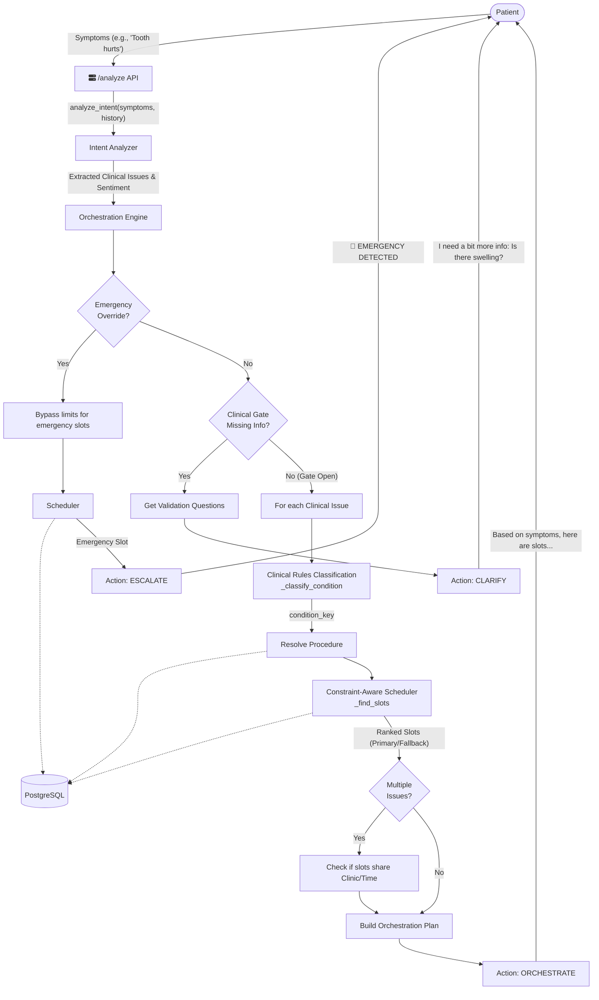

# Appointment Booking Flow Mechanism

Here is a detailed breakdown of how the backend processes user input from the first message to generating scheduled appointment options, followed by a Mermaid sequence diagram visualizing the architecture.

## 1. Entry Point: `/analyze` API
When a user sends a message describing their symptoms (e.g., "I have a toothache and I need a cleaning"), the frontend sends a `POST` request to the `/analyze` endpoint in [routers/triage.py](file:///home/ubuntu/bronn-dev/backend/routers/triage.py). This endpoint manages rate limiting and authenticates the tenant/user before starting the orchestration pipeline.

## 2. Intent Analysis ([intent_analyzer.py](file:///home/ubuntu/bronn-dev/backend/core/intent_analyzer.py))
The user's symptoms, along with previous chat history and any structured data fragments, are passed to the **Intent Analyzer**. 
- It uses a structured LLM call to extract specific **Clinical Issues** (e.g., pain severity, swelling, bleeding).
- It identifies the patient's sentiment and determines if there are immediate safety flags or an overall emergency state.

## 3. Clinical Gate Assessment ([clinical_gate.py](file:///home/ubuntu/bronn-dev/backend/core/clinical_gate.py))
Before routing scheduling, the **Clinical Gate** acts as an AI "Doctor". It evaluates the clinical issues extracted by the Intent Analyzer to determine if crucial information is missing.
- If information is missing, the gate generates strict, doctor-like follow-up questions (e.g., "Is the pain sensitive to hot or cold?").
- The system interrupts the flow and returns these clarification questions to the user (`suggested_action = "CLARIFY"`).

## 4. Clinical Rules Classification ([orchestration_engine.py](file:///home/ubuntu/bronn-dev/backend/core/orchestration_engine.py))
If the clinical gate determines the information is complete, the **Orchestration Engine** takes over. 

It applies deterministic **Clinical Rules** ([_classify_condition](file:///home/ubuntu/bronn-dev/backend/core/orchestration_engine.py#200-261)) to map the extracted feature flags (like swelling + wisdom) into a standardized `condition_key` (e.g., `wisdom_extraction`, `root_canal`). This guarantees that similar symptom presentations predictably result in the same medical categorization without hallucination.

**Why this exists:**
Language models (LLMs) are great at reading a paragraph and extracting facts like "patient has swelling" and "pain level is 8". However, LLMs are not good at consistently applying medical routing logic without occasionally hallucinating or changing their minds. By separating the flow, the LLM only does extraction (Intent Analyzer), and this `_classify_condition` function does the medical logic. This guarantees that if two different patients both have [Swelling + Wisdom Tooth Pain], they will 100% of the time be routed to the exact same surgical path.

**How it works step-by-step:**
The function evaluates the extracted issue data through a strict hierarchy of Tiers (from most urgent to least urgent). As soon as a tier's conditions are met, it instantly returns that classification and stops checking the others.

*   **Tier 1: Emergency Rules (Target: `"emergency"`)**
    The system first checks for life-threatening or immediate-action flags. If the LLM extracted that the patient has Airway compromise, Dental trauma, or Uncontrolled bleeding, the system immediately classifies this as an `"emergency"`.
*   **Tier 2: Endodontic Rules (Target: `"root_canal"`)**
    If it's not an emergency, it checks for nerve/root damage. The rule states that a patient needs a root canal evaluation IF Pain severity is Severe (7 or higher out of 10) AND there is pain present AND they have either Thermal Sensitivity (pain from hot/cold) OR Biting Pain AND they do not have swelling.
*   **Tier 3: Surgical Rules (Target: `"wisdom_extraction"`)**
    Next, it looks for surgical indicators. It routes to oral surgery IF the patient has Swelling AND (an impacted wisdom tooth OR the word "wisdom" in their symptoms), OR the patient has Swelling AND the word "extraction" is in their symptoms.
*   **Tier 4: Restorative Rules (Target: `"filling"`)**
    If none of the severe surgical or endodontic rules triggered, it checks for a basic cavity. It routes to a general filling evaluation IF the patient has pain AND the pain severity is Moderate (6 or lower out of 10) AND there is NO swelling AND NO thermal sensitivity.
*   **Tier 5: General Fallback (Target: `"general_checkup"` etc.)**
    If the clinical feature flags didn't trigger any of the strict rules above, it falls back to a simple keyword search on the symptom description (e.g., "root canal" -> "root_canal", "clean" -> "general_checkup"). If absolutely nothing matches, it defaults to `"general_checkup"` with the reasoning "Routine follow-up".

**The Output:**
The function returns two things:
1. The **`condition_key`** (e.g., `"root_canal"`). This key is then used by the next step to look up real procedures and doctors in the PostgreSQL database.
2. A list of **triggers** (e.g., `["Severe pain", "Thermal sensitivity"]`). These strings are passed all the way to the frontend so the system has an audit trail explaining exactly why the deterministic engine made that routing decision.

## 5. Procedure Resolution ([orchestration_engine.py](file:///home/ubuntu/bronn-dev/backend/core/orchestration_engine.py))
The engine maps the generated `condition_key` to a real DB `Procedure` record ([_resolve_procedure](file:///home/ubuntu/bronn-dev/backend/core/orchestration_engine.py#266-293)), taking tenant scoping into account. For instance, `root_canal` might resolve to the "Endodontic Evaluation (Microscope)" procedure, which dictate base duration and anesthetist requirements.

## 6. Constraint-Aware Scheduling ([routing_engine.py](file:///home/ubuntu/bronn-dev/backend/core/routing_engine.py) & [scheduling_engine.py](file:///home/ubuntu/bronn-dev/backend/core/scheduling_engine.py))
For each resolved procedure, the Orchestration Engine calls the **Constraint-Aware Scheduler** ([_find_slots](file:///home/ubuntu/bronn-dev/backend/core/orchestration_engine.py#298-317)).
- It enforces hardware and resource constraints (e.g., does this room have the right equipment? Do we need an anesthetist for sedation?).
- It retrieves ranked slot options based on availability, falling back to alternative providers or modalities if primary options are unavailable.

## 7. Orchestration Combiner
If a user presents multiple issues (e.g., a toothache and a cleaning), the Orchestration Engine tries to combine them. It checks if the suggested slots for different procedures share the same `clinic_id` and overlapping resource availability to offer a **single visit** to the patient.

## 8. Response Delivery
Finally, the [routers/triage.py](file:///home/ubuntu/bronn-dev/backend/routers/triage.py) endpoint packages the [OrchestrationPlan](file:///home/ubuntu/bronn-dev/backend/core/orchestration_engine.py#47-98) into a final response payload containing:
- The suggested action (`ORCHESTRATE`, `CLARIFY`, `ESCALATE`).
- Liability-safe routing language.
- The scheduled slot times and specialist types.

---

> [!NOTE]
> The engine strictly prioritizes explicit constraints and clinical completeness. If a symptom is deemed an emergency at any stage, it entirely bypasses the clinical gate and immediately flags the session for an Emergency Override (`ESCALATE`), locking down an emergency slot if available.

### Architecture Diagram



---

## Example Scenario: Multi-Condition Triage

**Patient Input:**
> *"Hi, I have severe pain in my upper right tooth, especially at night and with hot or cold drinks. I also have an impacted wisdom tooth that swells sometimes."*

Here is exactly how the backend architecture processes that message:

### 1. The Intent Analyzer (LLM Extraction)
Because the system supports **Multi-Condition** triage, the LLM will identify two distinct issues and extract structured **boolean feature flags**. It outputs JSON similar to:
```json
{
  "issues": [
    {
      "symptom_cluster": "severe pain in upper right tooth at night and with temperature",
      "urgency": "HIGH",
      "has_pain": true,
      "severity": 8,
      "thermal_sensitivity": true,
      "location": "upper right",
      "reported_symptoms": ["night pain", "hot/cold sensitivity"]
    },
    {
      "symptom_cluster": "impacted wisdom tooth with occasional swelling",
      "urgency": "MEDIUM",
      "swelling": true,
      "impacted_wisdom": true,
      "reported_symptoms": ["swelling", "impacted"]
    }
  ],
  "patient_sentiment": "Anxious"
}
```

### 2. The Clinical Gate (Quality Control)
Before ANY routing happens, the `OrchestrationEngine` passes these issues to the **Clinical Gate** to verify if the medical profile is complete for a referral.

*   **Evaluating Issue 1 (The Toothache):** The Gate infers an Endodontic domain because of the `thermal_sensitivity` and "night pain". It checks the Endo Completeness Profile. We know the *location* (upper right), the *stimulus* (hot/cold), and the *chronobiology* (at night). **Result:** Complete.
*   **Evaluating Issue 2 (The Wisdom Tooth):** The Gate infers a Surgical domain. The Surgical Profile strictly requires knowing the `swelling_location` (Inside only? Visible outside?). **Result:** Incomplete.

**The Gate's Decision:** Because Issue 2 is missing critical safety data, the Gate interrupts the scheduling flow. The API returns the action **`CLARIFY`** along with a generated question: *"Is the swelling confined strictly to the gums inside your mouth, or is it visibly expanding on the outside of your face, jaw, or neck?"*

### 3. State Merging
The user replies: *"Just on the gums inside."*
The Intent Analyzer receives this short message, looks at the active chat history, and uses a state-merging function (`_merge_with_previous_issues`) to apply this new `swelling_location` answer perfectly into Issue #2 without "forgetting" about Issue #1. 
The Clinical Gate runs again, and this time, both profiles pass 100%. The Gate opens, and the action changes to **`ROUTE`**.

### 4. Clinical Rules Classification (Deterministic Matrix)
The `Orchestration Engine` takes over to deterministically figure out the required medical procedure based on the feature flags, bypassing LLM hallucination.
*   **Issue 1:** Hits Tier 2 (Endodontic Rules). Because `has_pain=True`, severity is "severe", and `thermal_sensitivity=True`, it instantly returns the `condition_key` **`root_canal`**.
*   **Issue 2:** Hits Tier 3 (Surgical Rules). Because `swelling=True` and `impacted_wisdom=True`, it returns the `condition_key` **`wisdom_extraction`**.

### 5. Procedure Resolution
The database layer maps the abstract keys to real, tenant-scoped procedures:
*   `"root_canal"` -> Maps to `"Endodontic Evaluation"` (requires an **Endodontist**).
*   `"wisdom_extraction"` -> Maps to `"Oral Surgery Consultation"` (requires an **Oral Surgeon**).

### 6. Scheduling & Combining
The `Scheduling Engine` constraint solver searches the 15-minute grid.
*   It searches for contiguous blocks where an Endodontist is available.
*   It searches for blocks where an Oral Surgeon is available.
*   **The Magic:** The `OrchestrationPlan.combined_visit_possible` logic scans the results to see if both doctors work at the same `clinic_id` on the same day. It attempts to find overlapping contiguous blocks so the patient can have their toothache evaluated and their wisdom tooth examined back-to-back in a **single visit**.

### 7. Final Output
The system generates a safe, physician-forward referral text and packages up the FHIR bundle. The user receives a localized response summarizing the plan:

> *"Based on the information provided, I've identified **2 concerns** that warrant specialist evaluation:*
> *1. **Severe pain in upper right tooth** → Evaluation by **Endodontist***
> *2. **Impacted wisdom tooth with swelling** → Evaluation by **Oral Surgeon***
> 
> *✨ Good news — we may be able to schedule these evaluations during a **single visit**."*
